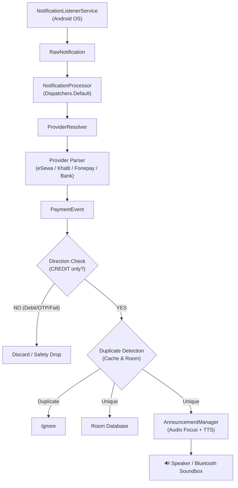

# MoneyBol (मनीबोल) 🔊🇳🇵

> **Your phone. Your payment soundbox.**  
> An open-source, privacy-first Android application that turns any Android smartphone into a payment announcement soundbox for merchants in Nepal.

---

## 📖 Overview

In Nepal, merchants often rely on dedicated proprietary soundbox hardware to announce QR payments (eSewa, Khalti, Fonepay, mobile banking). These devices incur hardware costs, rental fees, and vendor lock-in.

**MoneyBol** turns an existing Android phone into a payment soundbox by intelligently listening to payment notifications, extracting transaction details with high-precision parsers, and instantly announcing incoming payments in clear spoken words (Nepali/English).

---

## ✨ Features

- ⚡ **Instant Voice Announcements**: Immediate Text-to-Speech (TTS) announcement upon receiving credit notifications.
- 🗣️ **Nepali & English Spoken Formats**: Converts numbers into natural South Asian numbering (Lakhs, Crores, Paisa) or compact announcement formats.
- 🛡️ **Zero-Network Privacy**: **No `INTERNET` permission** requested. All processing, parsing, and storage happens 100% locally on-device.
- 🔐 **Fraud & OTP Protection**: Rigorous multi-stage direction detection ensures OTPs, debits, login alerts, and failed transactions are **never** announced.
- 🔁 **Smart Duplicate Suppression**: Eliminates duplicate voice alerts when both a wallet app and a bank send simultaneous notifications for the same transaction.
- 📊 **Merchant Dashboard**: Live listening status, last transaction card with quick replay, and daily revenue summaries.
- 📜 **Offline Transaction History**: Grouped transaction logs (Today, Yesterday, Earlier) with provider filtering and daily statistics powered by Room DB.
- 🔋 **Background Resilience**: Dedicated Foreground Service and `BOOT_COMPLETED` auto-recovery to maintain 24/7 reliability.

---

## 🏦 Supported Providers

MoneyBol includes modular parsers designed for Nepal's digital payment ecosystem:

| Provider | Type | Status |
|---|---|---|
| **eSewa** | Digital Wallet | Supported (Format Unverified*) |
| **Khalti** | Digital Wallet | Supported (Format Unverified*) |
| **Fonepay** | QR Payment Network | Supported (Format Unverified*) |
| **NepalPay** | National Payment Switch | Supported (Format Unverified*) |
| **Generic Bank Parser** | Mobile Banking Apps | Conservative Fallback Parser |

*\*Note: Marked as `FORMAT_UNVERIFIED` until verified against live merchant notifications on physical devices.*

---

## 🏗️ Architecture



---

## 🛠️ Tech Stack

- **Language**: Kotlin 2.0.20
- **UI Framework**: Jetpack Compose with Material 3
- **Architecture**: Clean Architecture + MVVM + Coroutines & Flow
- **Dependency Injection**: Hilt (Dagger)
- **Local Persistence**: Room Database 2.6.1 + Jetpack DataStore Preferences
- **Build System**: Gradle 8.9 with Version Catalog (`libs.versions.toml`)
- **Target SDK**: Android 14 (API 34), Min SDK: Android 8.0 (API 26)

---

## 🚀 Getting Started

### Prerequisites

- **Android Studio Jellyfish | 2023.3.1** or newer
- **JDK 17** (recommended for AGP 8.5+)
- Android device running Android 8.0+ (API 26+)

### Installation & Build

1. Clone the repository:
   ```bash
   git clone https://github.com/<your-username>/MoneyBol.git
   cd MoneyBol
   ```

2. Open the project in **Android Studio**:
   - Select **File > Open** and navigate to the `MoneyBol` directory.
   - Allow Android Studio to sync Gradle dependencies.

3. Run unit tests (74 tests covering parsing, OTP defense, and dedup):
   ```bash
   ./gradlew test
   ```

4. Build and install the debug APK on your phone:
   ```bash
   ./gradlew assembleDebug
   ```

### Device Setup

1. **Grant Notification Access**:
   - Open MoneyBol on your device.
   - Follow the onboarding flow or go to `Settings > Special App Access > Notification Access` and toggle on **MoneyBol**.
2. **Disable Battery Optimization** (Recommended):
   - In your phone's battery settings, set MoneyBol to **Unrestricted** or **Don't Optimize** so the system does not kill the listener service when the phone is idle.
3. **Test Soundbox**:
   - Tap **"Test Announcement"** on the home screen to ensure your device's Text-to-Speech engine is working properly.

---

## 🧪 Testing

The codebase comes with **74 comprehensive unit tests** across 7 test suites:

```
app/src/test/java/com/moneybol/app/
├── core/util/
│   ├── AmountParserTest.kt           # Parsing Rs, NPR, रु, Devanagari numerals
│   ├── DirectionDetectorTest.kt      # Credit vs Debit, OTP safety prioritization
│   ├── NepaliNumberConverterTest.kt  # Devanagari to Arabic numerals
│   └── TransactionIdExtractorTest.kt # Ref ID extraction & OTP rejection
├── payments/
│   └── DuplicateDetectorTest.kt      # Fingerprint and transaction dedup
└── audio/
    ├── AmountToWordsConverterTest.kt # Lakh/Crore and paisa conversions
    └── AnnouncementFormatterTest.kt  # Format styles and privacy guards
```

---

## 🔒 Security & Privacy Guarantees

- **No Network Permission**: MoneyBol has no `<uses-permission android:name="android.permission.INTERNET" />` in its manifest. It cannot send data anywhere.
- **No Credentials**: MoneyBol never asks for your bank password, PIN, transaction MPIN, or wallet credentials.
- **Strict OTP Defense**: OTP and 2FA notifications are detected via safety-priority heuristics and immediately suppressed.
- **Zero Raw PII Storage**: Full SMS and notification text bodies are never stored into the persistent database.

---

## 📄 License

This project is licensed under the [Apache License 2.0](LICENSE).
